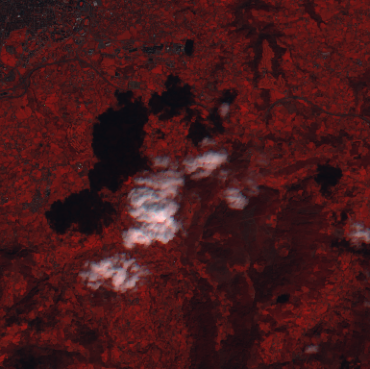
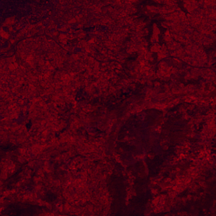

# Bachelor's Degree Final Project: Unsupervised Deep Learning: An Application to the Reconstruction of Satellite Images

This repository contains the implementation and results of my Bachelor's Degree Final Project:___, which addresses the challenge of detecting and removing clouds and shadows from satellite hyperspectral image sequences. Satellite images are crucial for numerous scientific disciplines, but their effectiveness is often hindered by cloud coverage and shadows. The project leverages artificial intelligence, particularly neural networks and the Deep Image Prior technique, to develop a solution. Below is a summary of the project.

## Key Components

- **Introduction**: Overview of satellite hyperspectral imagery and its relevance in fields such as telecommunications, agriculture, and climate research, along with a brief introduction to artificial intelligence.  
- **Methodology**: Implementation of an adapted convolutional neural network (CNN) architecture, inspired by a U-Net model, to address the problem using inpainting techniques. The algorithm builds upon the work of Zhang et al. (2022), incorporating enhancements from my previous Mathematics Bachelor's Degree Final Project.  
- **Implementation**: The algorithm was developed in Python, with a focus on accessibility for practical application and future research.  
- **Results**: Qualitative validation through visual inspection and quantitative validation using synthetic data generated by AI-based models.  
- **Conclusions**: A summary of findings and recommendations for future research directions in the field.

You can find the complete documentation at the following link: [Overleaf Project](https://www.overleaf.com/project/66a2194769e4ebe495ad7f48).

## Code

The repository includes the code organized in the `code` directory:  
- **maskAlgorithm**: A script containing the first part of the algorithm, which generates the cloud and shadow masks from satellite hyperspectral image sequences.  
- **cloudShadowRemovalNet**: A script defining the class that implements a convolutional neural network (CNN) inspired by the U-Net architecture.  
- **main.py**: The main script that integrates the algorithm's functions and executes the complete process.
- **download.py**: A script to download the Sentinel-2 L1C collection from the Copernicus API. To run this script, it is necessary to install the `sentinelhub` package. You can install it using:  
  ```bash
  pip install sentinelhub
  
The repository also includes all the necessary libraries to run the code, specified in the `requirements.txt` file.

## Example

The repository includes a demostration in the `example` directory. This folder contains:
  - The original satellite image.
  - The cloud and shadow mask of the first time node.
  - The result of applying the algorithm.
    
Below are some images from an example:
<p align="center">
  
  
</p>


